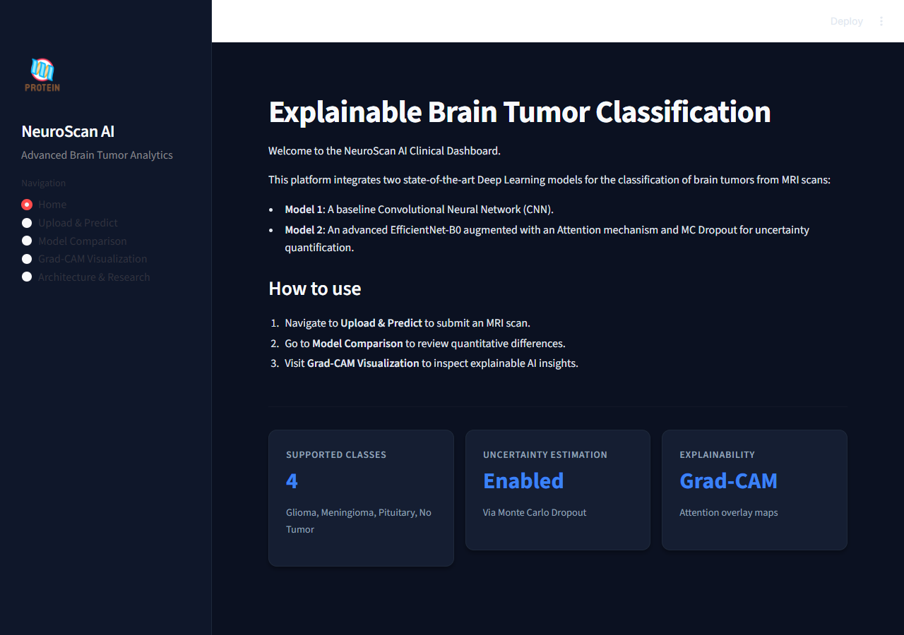
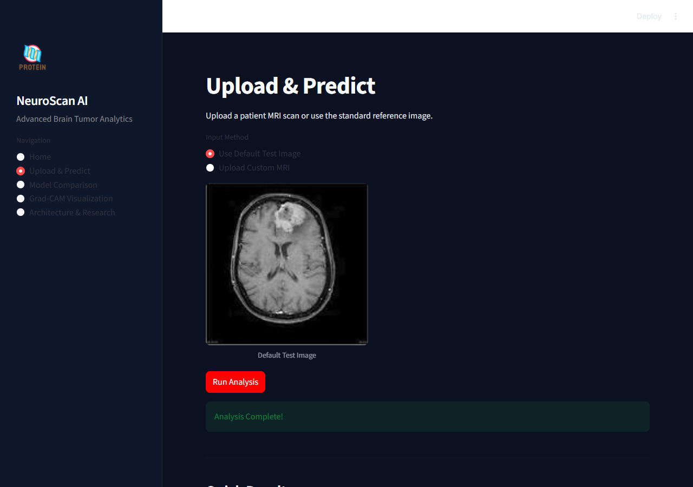
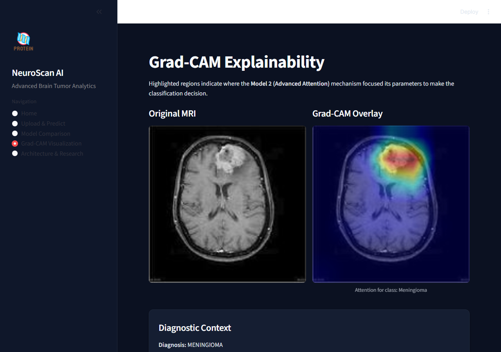
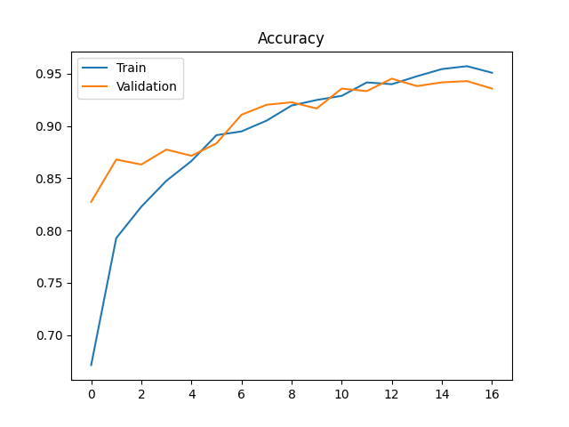
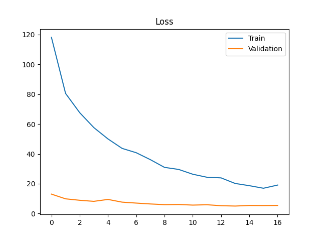
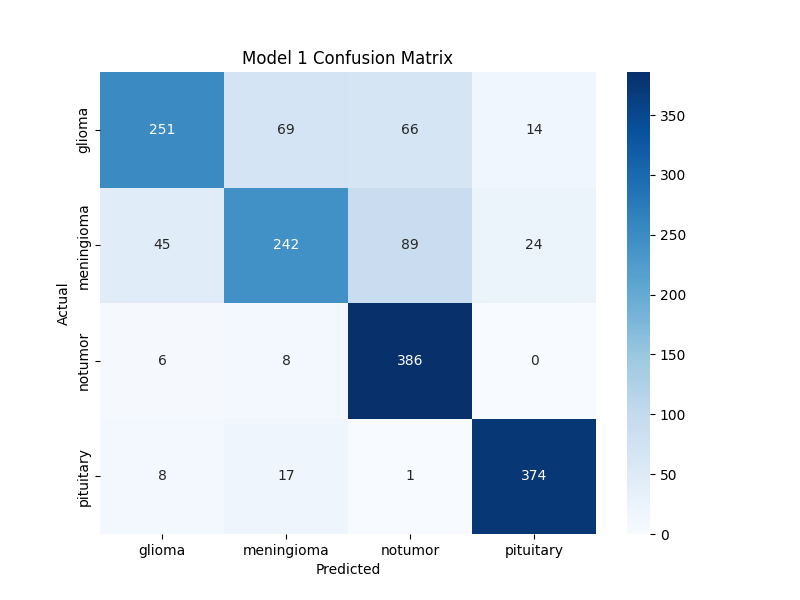
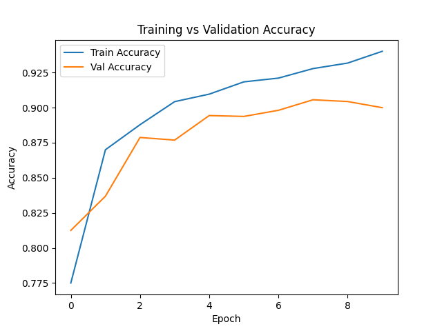
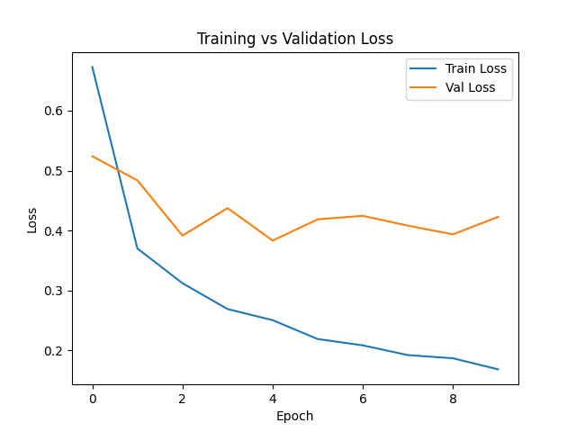
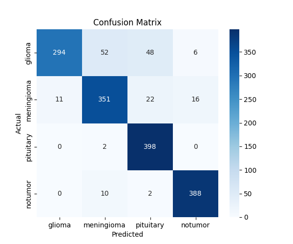

# Explainable Brain Tumor Classification

A clinical-grade diagnostic dashboard built on top of customized PyTorch deep learning models to predict brain tumor classifications from MRI scans.

**🌍 Try the Live Application Here:** [https://braintumordetections.streamlit.app/](https://braintumordetections.streamlit.app/)

This system demonstrates a comparative analysis between a baseline Convolutional Neural Network (CNN) and an advanced Vision architecture (EfficientNet-B0 combined with a custom Attention mechanism + MC Dropout), providing interpretable decisions through Grad-CAM algorithms.

## App Demonstration

The Streamlit UI provides an interactive environment to upload images, test models simultaneously, compare their speeds and probabilities, and introspect visual heatmaps.

### 1. Unified Dashboard


### 2. Live Model Comparison


### 3. Explainable Grad-CAM Heatmaps


*Proof of functioning: The application fully operates and evaluates both models simultaneously while visualizing output probability distributions and architecture metrics.*

---

## 🔬 Research & Architectures

The project relies on two models trained separately on a four-class MRI dataset: `[Glioma, Meningioma, Pituitary, No Tumor]`.

### Model 1: Baseline CNN

A pure Convolutional Neural Network built from scratch, utilizing standard alternating layers of **Conv2D** and **MaxPool2D**. This acts as the project's performance baseline.

- **Objective**: Establish base accuracy without advanced pretraining.
- **Components**: 3 Convolutional Blocks, Dropout(0.5).

#### Training Visualizations (Model 1)

<div style="display: flex; flex-direction: row; gap: 10px;">
  
  
  
</div>

---

### Model 2: Advanced EfficientNet with Attention

Designed for superior predictive capabilities, this model bridges transfer learning with advanced attention mechanism strategies.

- **Backbone**: `EfficientNet-B0` (Pretrained on ImageNet). Used specifically as a robust feature extractor.
- **Attention Layer**: A sequence-styled Attention network translates the `1280`-dimensional features to weighted context feature maps, concentrating the model's focus on defining characteristics of the tumors.
- **Uncertainty Mapping**: Unlike Model 1, Model 2 preserves Dropout layers active during inference. By performing **Monte Carlo Dropout** across 20 forward passes, we retrieve both epistemic uncertainty (variance) and confidence ratings, classifying predictions as either *Low*, *Medium*, or *High* uncertainty.
- **Inference Stability**: Implemented **Early Stopping** (patience=5) and standard **ImageNet Normalization** to ensure the model generalizes effectively without the validation loss instability seen in early baseline runs.

#### Performance Metrics (Final Model)
- **Overall Accuracy**: **89-90%** (Macro Avg: 0.90)
- **Class-Specific Insights**:
  - **Pituitary/No Tumor**: Near-perfect recapture (**97-99% recall**).
  - **Glioma/Meningioma**: Strong precision (~0.96 for Glioma), with recall at **0.73** – representing the primary diagnostic challenge needing clinical cross-verification via Grad-CAM.

#### Training Visualizations (Model 2)
*(Generated after Early Stopping at Epoch 10)*
<div style="display: flex; flex-direction: row; gap: 10px;">
  
  
  
</div>

---

## 🧠 Explainable AI (Grad-CAM)

Accuracy is critical in clinical settings, but **trust** is more important. The integration of **Gradient-weighted Class Activation Mapping (Grad-CAM)** enables visualization of the feature layers in Model 2. 

The application dynamically computes gradients for the predicted class at the final feature layer of the EfficientNet backbone and overlays a colored heatmap atop the original MRI inputs. This helps doctors manually verify if the model is investigating the correct tissue malformations rather than artifacts in the MRI scan.

---

## 💻 Tech Stack & UI

The frontend is completely powered by **Streamlit**, decorated with a minimalist, black-and-blue dark mode matching modern sleek UI paradigms.
- **PyTorch** & **Torchvision**: Core deep learning.
- **OpenCV** & **PIL**: Tensor preprocessing and image coloring.
- **Plotly**: For real-time probability distribution mapping.

## 🚀 How to Run Locally

If you are cloning this repository, you must have Python > 3.9 installed.

1. **Activate Environment** (If applicable):
   ```bash
   venv\\Scripts\\Activate.ps1
   ```
2. **Install Frontend Requirements**:
   ```bash
   python -m pip install streamlit plotly
   ```
3. **Launch Dashboard**:
   ```bash
   streamlit run app/streamlit_app.py
   ```
   Navigate to the local URL (usually `http://localhost:8501`) provided by Streamlit.
